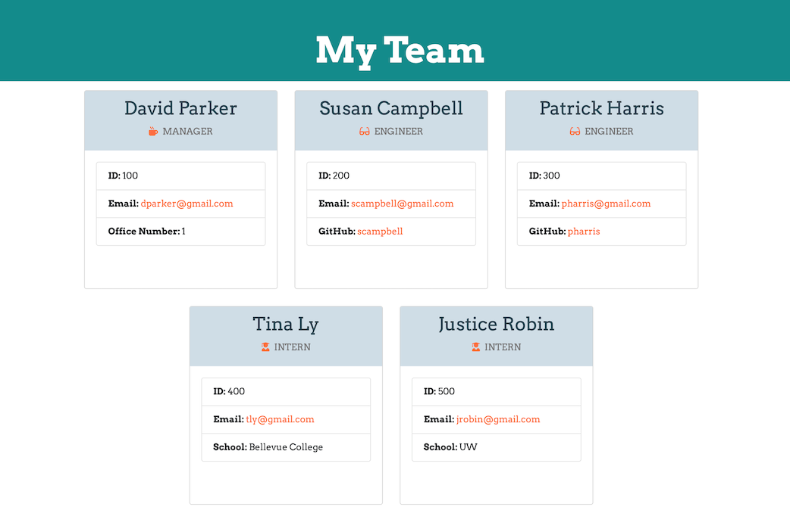

# [Team-Profile-Generator](https://) 

## Description

Team Profile Generator is a command-line-interface application, that allows the user to easily 
generate a team profile webpage, featuring summaries of their team members. 
All they have to do is answer a series of prompted quesitons on the command line about each members, 
and an HTML file will automatically be generated. 

The user is first prompted to answer questions about their team manager. Then they may add as many engineers and interns as they like, and answer questions about them. When they have finished adding all the team members that they would like to, they may open up their generated html document in the browser and view their new team profile!

## Table of Contents
* [Usage](#usage)
* [Technologies](#technologies)
* [Questions](#questions)
* [Installation](#Installation)
* [Finished Product](#finished-product)


## Usage
* Navigate to Team-Profile-Generator folder and install dependencies.
* Run node app.js to start.
* Answer prompted questions about team members.
* Add manager, and as many engineers and interns as the user wants.
* Select the "I'm done" option when finish adding team members.
* Open your generated HTML file in the browser to view teams profile.

### Answer these Questions:


### Generate a Team Profile like this:


## Technologies
* HTML
* CSS
* JavaScript
* Node.js
* npm
* Inquirer.js
* Bootstrap

## Installation
To install necessary dependencies, run the following command: 
``` 
npm install 
``` 

## Finished Product
View a sample of the generated HTML [here](https://github.com/jpreston-alt/Team-Profile-Generator/blob/master/output/team.html).<br>

## Questions
​
If you have any questions about the repo, please contact me:

On GitHub: [sdemkovich](https://github.com/sdemkovich) 
