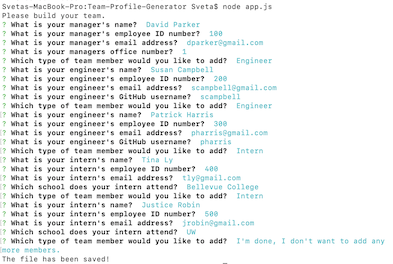

# [Team-Profile-Generator](https://) 


## Description

Team Profile Generator is a command-line-interface application, that allows the user to easily generate a team profile webpage, featuring summaries of their team members. All they have to do is answer a series of prompted quesitons on the command line about each members, and an HTML file will automatically be generated. 

The user is first prompted to answer questions about their team manager. Then they may add as many engineers and interns as they like, and answer questions about them. When they have finished adding all the team members that they would like to, they may open up their generated html document in the browser and view their new team profile!

Building this program taught me so much about object oriented programing, and how to structure an application around objects and modules. It taught me about inheritance, and using classes and subclasses to build objects that are similar to one another without having to repeat code. I also learned about jest, test driven development, and writing code first to pass tests. I continued to get more comfortable working in Node and with npm, and I learned about validating user input using inquirer.

## Table of Contents
* [Usage](#usage)
* [Technologies](#technologies)
* [Questions](#questions)
* [Installation](#Installation)
* [Tests](#Tests)
* [Credits](#Credits)
* [Finished Product](#finished-product)


## Usage
* Navigate to Team-Profile-Generator folder and install dependencies.
* Run node app.js to begin.
* Answer prompted questions about team members.
* May add one manager, and as many engineers and interns as the user wants.
* When you are finished adding team members select the "I'm done" option.
* Open your generated HTML file in the browser to view your teams profile.

### Answer these Questions:


### Generate a Team Profile like this:


## Technologies
* JavaScript
* Node.js
* Jest
* npm
* Inquirer.js
* HTML
* CSS
* Bootstrap


## Installation
To install necessary dependencies, run the following command: 
``` 
npm install 
``` 

## Tests
To run tests, run the following command: 
``` 
npm run test 
```

## Finished Product
View a sample of the generated HTML [here](https://github.com/jpreston-alt/Team-Profile-Generator/blob/master/output/team.html).<br>
View a video demonstrating the application [here](https://drive.google.com/file/d/1GXXnc2q5sv7_aGnGXkHwB0Wg7uvSFpcF/view).


## Questions
​
If you have any questions about the repo, please contact me:

On GitHub: [sdemkovich](https://github.com/sdemkovich) 
